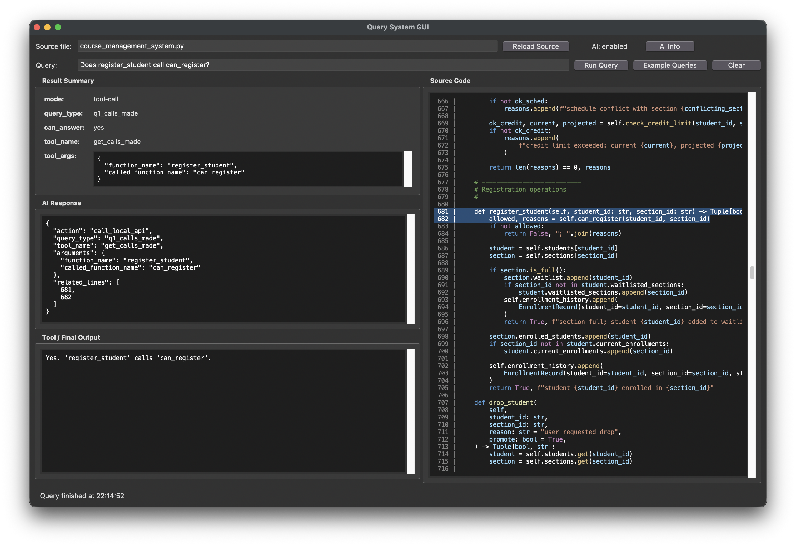
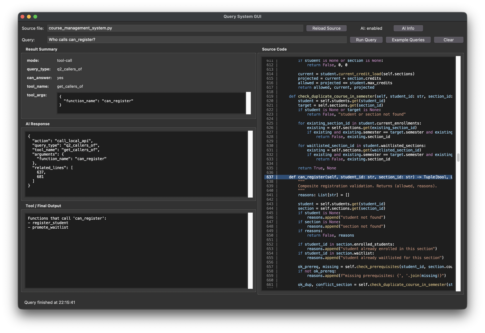
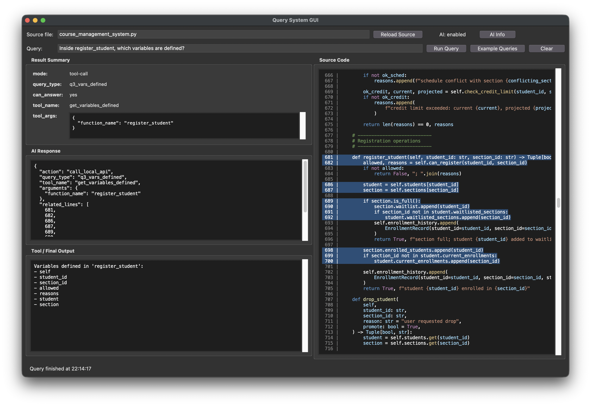
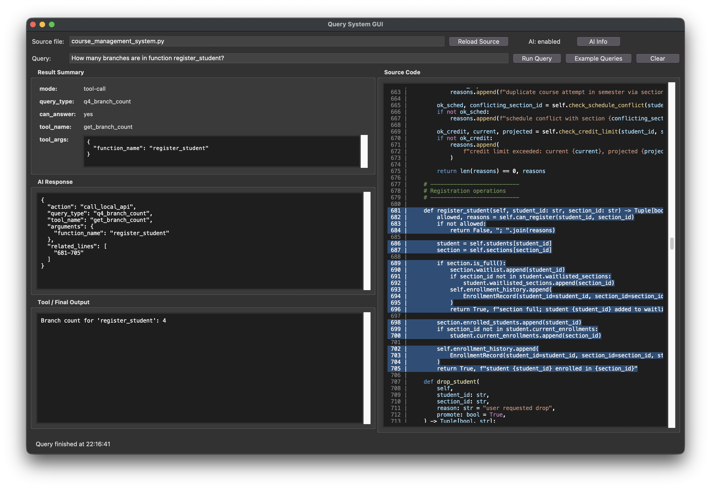
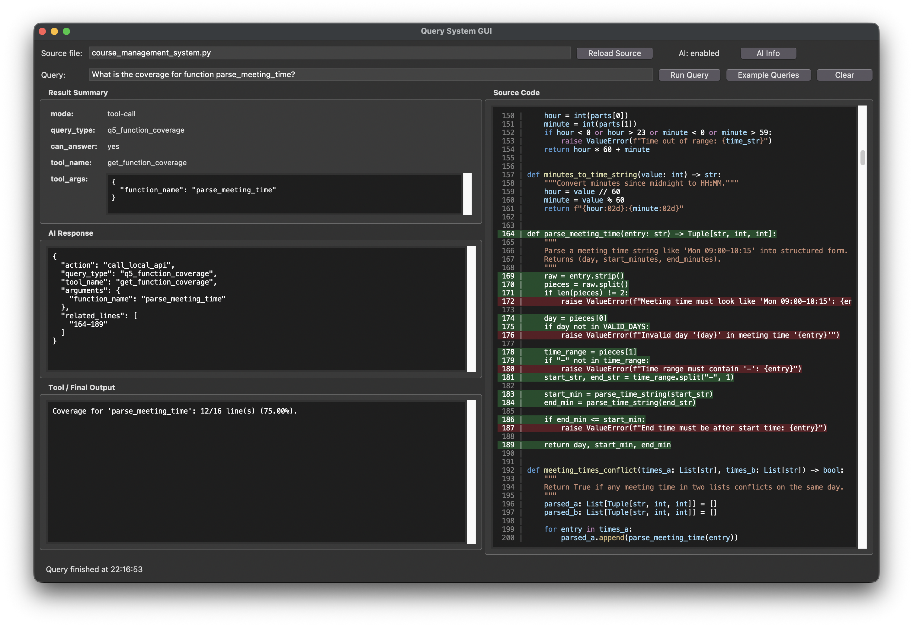
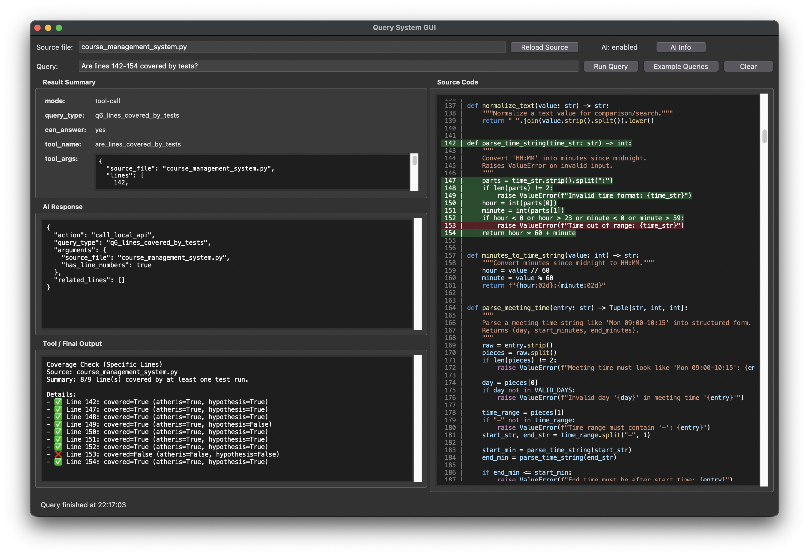
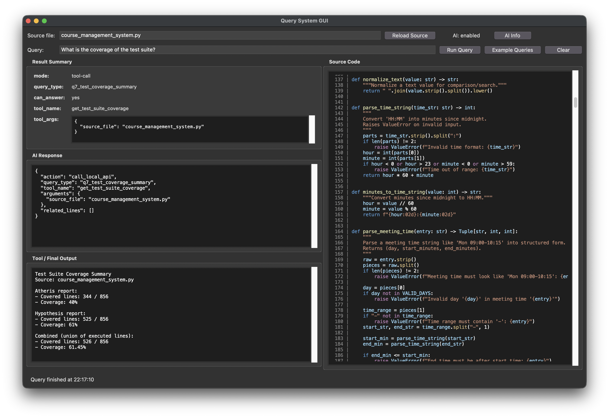
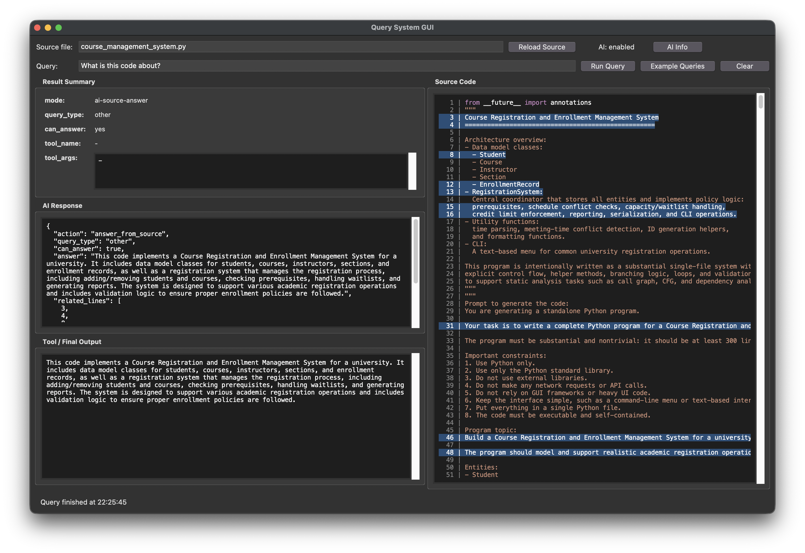
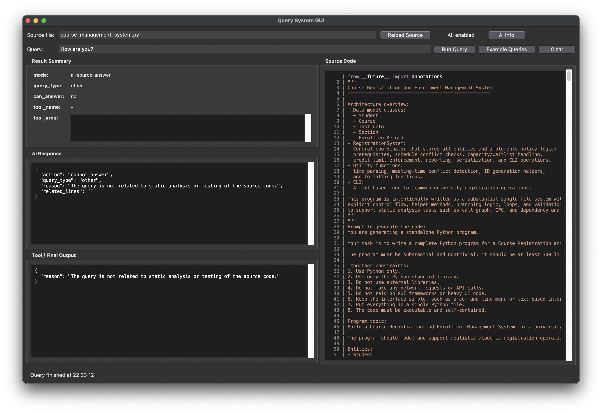

# COMS 5130 Final Project — Part 3 (Query System Progress)

## Introduction

Our query system takes a natural-language question, routes it through an AI-based query router, executes local analysis tools, and returns a structured answer for the GUI.

High-level flow:

1. User asks a natural-language query.
2. AI router returns structured JSON (`action`, `query_type`, `tool_name`, `arguments`, optional `related_lines`).
3. Runtime applies a **tool-first policy**:
	 - if the query matches a supported type with a local tool, call local tool(s);
	 - otherwise fall back to source-based answering.
4. Result is returned with summary metadata + answer payload.

<details>
<summary><strong>AI Router Prompt</strong></summary>

```text
You are a query router and answerer for static-analysis or testing questions over a Python source file.
Return ONLY JSON, no markdown.
Allowed JSON formats:
1) {"action":"call_local_api","query_type":"...","tool_name":"...","arguments":{...},"related_lines":[...]|"start-end"}
2) {"action":"answer_from_source","query_type":"...","can_answer":true,"answer":"...","related_lines":[]}
3) {"action":"cannot_answer","query_type":"...","reason":"...","related_lines":[...]}
4) {"action":"delegate_to_regex"}
Supported query types: q1_calls_made, q2_callers_of, q3_vars_defined, q4_branch_count, q5_function_coverage, q6_lines_covered_by_tests, q7_test_coverage_summary, other.
Decision policy:
- If query is not related to the analysis or testing of the source code or it is not a valid query, return cannot_answer.
- If query is one of the supported types AND a suitable local tool exists, you MUST return call_local_api.
- If query is one of the supported types but no suitable local tool exists, inspect source and return answer_from_source or cannot_answer.
- If query is not one of the supported types, inspect source and return answer_from_source or cannot_answer.
- Always prefer local tools over source-only answering when a tool can solve the query.
- Never invent tool names; choose only from available tools listed below.
- For call_local_api, include related_lines whenever the source contains clear evidence (otherwise use []).
- Exception: for q6_lines_covered_by_tests, set related_lines to [] because runtime derives exact lines from the query text.
- For q5_function_coverage, include the full function line range in related_lines as a single range string when available (example: "164-189").
- For answer_from_source, include related_lines as the most relevant 1-based source line numbers when possible.
- The source snippet you receive is line-numbered (e.g., ' 123: code'). Use those exact numbers in related_lines.
- related_lines must be grounded in the provided source snippet, not guessed.
- The number of lines should be minimal and directly relevant. Do not include lines that only contain comments or whitespace.
- Do NOT use placeholder or repeated canned line numbers. If uncertain, use an empty list [].
Known available tool names and corresponding scope:
- get_calls_made: input=function_name (caller), optional called_function_name. Output=all callees, or boolean membership check when called_function_name is provided.
- get_callers_of: input=function_name (callee). Output=functions that call that function.
- get_variables_defined: input=function_name. Output=variables defined inside that function.
- get_branch_count: input=function_name. Output=number of branches in that function.
- get_function_coverage: input=function_name. Output=line coverage for that function.
- are_lines_covered_by_tests: input=source_file + has_line_numbers. Runtime parses all line numbers.
- get_test_suite_coverage: input=source_file. Output=overall suite coverage summary.
Disambiguation examples:
- 'Does register_student call can_register?' => q1_calls_made using get_calls_made(function_name='register_student', called_function_name='can_register').
- 'Who calls can_register?' => q2_callers_of using get_callers_of(function_name='can_register').
- Pattern 'Does <A> call <B>?' is q1 (calls made by A), not q2.
Query type -> tool correspondence and required arguments:
- q1_calls_made -> get_calls_made(arguments={"function_name": "...", "called_function_name": "..." (optional)})
- q2_callers_of -> get_callers_of(arguments={"function_name": "..."})
- q3_vars_defined -> get_variables_defined(arguments={"function_name": "..."})
- q4_branch_count -> get_branch_count(arguments={"function_name": "..."})
- q5_function_coverage -> get_function_coverage(arguments={"function_name": "..."})
	For q5, include the function line range in related_lines as "start-end" when available.
- q6_lines_covered_by_tests -> are_lines_covered_by_tests(arguments={"source_file": "...", "has_line_numbers": true|false})
	For q6, related_lines must be [].
	IMPORTANT: Do NOT extract or list line numbers in arguments. Only decide whether the query contains at least one line number.
	The runtime will parse all line numbers locally and process coverage locally.
- q7_test_coverage_summary -> get_test_suite_coverage(arguments={"source_file": "..."})
Important: arguments must be a JSON object with primitive values/arrays/objects only.
```

</details>

## Query Types and Local APIs

| Query Type | Intent | Local API (key params) |
|---|---|---|
| `q1_calls_made` | Calls made by function `A` | `get_calls_made(function_name)` |
| `q2_callers_of` | Who calls function `B` | `get_callers_of(function_name)` |
| `q3_vars_defined` | Variables defined inside a function | `get_variables_defined(function_name)` |
| `q4_branch_count` | Number of branches in a function | `get_branch_count(function_name)` |
| `q5_function_coverage` | Function-level coverage summary | `get_function_coverage(function_name)` |
| `q6_lines_covered_by_tests` | Coverage of specific lines/ranges | `are_lines_covered_by_tests(source_file, lines)` *(lines parsed at runtime)* |
| `q7_test_coverage_summary` | Overall test-suite coverage | `get_test_suite_coverage(source_file)` |

## Implementation Details

### q1 — `query_calls_made`
- Renders `calls_made.ql.j2` with `caller_name`.
- Uses CodeQL result data from the `codeql-db` analysis output (CSV-decoded format).
- Returns unique callees from result column `col1`.

### q2 — `query_callers_of`
- Renders `callers_of.ql.j2` with `target_name`.
- Uses parsed CodeQL result rows for the target function.
- Returns unique caller names from `col1`.

### q3 — `query_variables_defined`
- Renders `variables_defined.ql.j2` with `function_name`.
- Uses CodeQL-derived rows and extracts variable names from `col1`.
- Returns a deduplicated variable list.

### q4 - `query_branch_count`
- Renders `branch_count.ql.j2` with `function_name`.
- Uses CodeQL-derived rows and reads the count from `col1`.
- Returns integer count (defaults to `0` if empty result).

### q5 — `query_coverage`
- Looks up function coverage in `hypothesis_coverage.json`.
- Matches either exact function name or class-qualified form (`Class.func`).
- Returns `lines_covered` and `lines_in_function` from coverage summary.


### q6 — `are_lines_covered_by_tests`
- Parse user-provided line numbers/ranges in runtime.
- Load coverage from:
	- `test_results/fuzzing/atheris/raw/coverage.json`
	- `test_results/fuzzing/hypothesis/raw/coverage.json`
- Compute per-line coverage status across Atheris/Hypothesis.
- Exclude non-code lines for highlighting (blank/comment/docstring/standalone string blocks).
- Return structured fields such as `per_line`, `covered_lines`, `total_lines`, and display answer text.

### q7 — `get_test_suite_coverage`
- Load the same two coverage reports as q6.
- Extract report summaries for the selected source file.
- Compute a combined view using **union of executed lines**.
- Return both per-tool summaries and combined summary (`covered_lines`, `num_statements`, `%`).

## Example Queries and Screenshots


### q1 — Calls made

Query: `Does register_student call can_register?`



### q2 — Callers of a function

Query: `Who calls can_register?`



### q3 — Variables defined

Query: `Inside register_student, which variables are defined?`



### q4 — Branch count

Query: `How many branches are in function register_student?`



### q5 — Function coverage

Query: `What is the coverage for function parse_meeting_time?`



### q6 — Specific line coverage

Query: `Are lines 142-154 covered by tests?`



### q7 — Test-suite coverage summary

Query: `What is the coverage of the test suite?`



### Other (can answer from source)

Query: `What is the code about?`



### Other (cannot answer)

Query: `How are you?`




