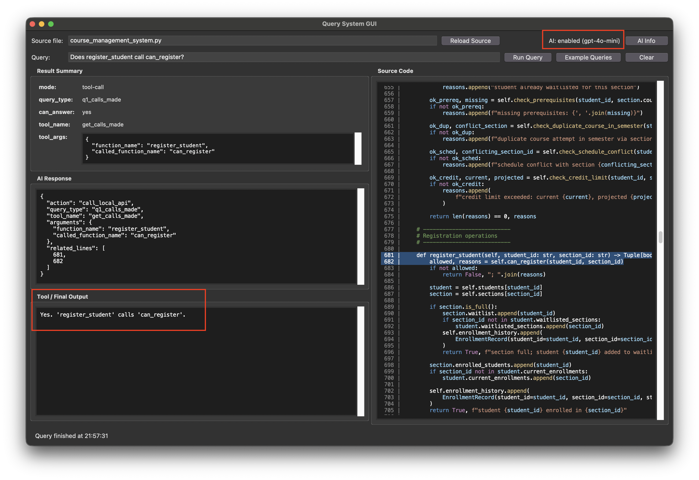

# COMS 5130 Final Project

Analysis of AI-generated Python code using static analysis, fuzzing, property-based testing, symbolic execution, and taint analysis.

Authors: Walker Wilcoxon, Hengbo Tong, Junhyung Shim, Kenny Jia Hui Leong, Haifeng Huang

---

## Repository Structure

```
course_management_system.py   # Subject program (AI-generated, 1471 lines)
query_gui.py                  # Tkinter GUI for the query interface
query_interface.py            # Natural-language query interface (9 query types)
query_system.py               # Backend: CodeQL + graph DB + coverage queries
queries/                      # Jinja2 CodeQL query templates (.ql.j2)
graph_database/               # Generated call graph and variable dependency JSON
call_graphs/                  # Call graph outputs (DOT, PNG, TXT)
cfg/                          # Per-function control-flow graphs (DOT, PNG)
pdg/                          # Program dependence graphs via Joern (DOT, SVG)
codeql-db/                    # CodeQL database for the subject program
test_results/
  static_analysis/            # PyLint JSON reports (full, warnings, refactors, conventions)
  fuzzing/atheris/            # Atheris fuzzer: raw log, coverage, crash, corpus, summary
  fuzzing/hypothesis/         # Hypothesis: raw coverage, JUnit XML, log, summary
  symbolic/crosshair/         # CrossHair: raw log, summary JSON/MD
  property_based_test/        # Property-based test HTML coverage report
  unit_test/                  # Unit test HTML coverage report + XLSX
  performance_stress_testing/ # Benchmark JSON results
build_cfg.py                  # Script to build CFGs
run_pylint.py                 # Script to run PyLint and write results
run_pytest_benchmark.py       # Script to run pytest-benchmark
property_test_course_management_system.py
test_course_management_system.py
test_query_interface.py
research_report.txt           # Final written report
```

---

## Installation

### Python Dependencies

```bash
python -m venv .venv
source .venv/bin/activate        # WSL/Linux/Mac
# .venv\Scripts\Activate.ps1    # Windows PowerShell
pip install -r requirements.txt
```

`atheris` and `python-scalpel` are Linux-only and are skipped automatically on Windows. To use fuzzing or CFG generation on Windows, run inside WSL.

### CodeQL

1. Download the CodeQL CLI from https://github.com/github/codeql-cli-binaries/releases (Linux build if using WSL).
2. Extract and add the `codeql` binary to your PATH.
3. Install the QL pack dependencies:
    ```bash
    codeql pack install
    ```

---

## Usage

### Query System GUI

The GUI accepts natural-language queries about the subject program and dispatches them to CodeQL, the call/variable dependency graphs, or coverage data. An OpenAI API key enables AI-assisted query routing; without one it falls back to regex matching.

```bash
export OPENAI_API_KEY="sk-..."   # optional — enables AI routing; we provide one API key in the final report with $9 credits left, should work fine for testing.
python query_gui.py
```



- The GUI should pop out directly on the screen, and there should be **"AI: enabled"** at the upper-right corner. If it says **"AI: disabled (fallback only)"**, there is probably something wrong with the API key or the OpenAI-related Python packages.

- Try running any simple query. If the output section (left side) reports no errors, then everything should work fine. If you see an error about CodeQL, it is likely that CodeQL is not installed/configured properly.


Example queries supported:
- Does register_student call can_register?
- Who calls can_register?
- Inside register_student, which variables are defined?
- What is the coverage for function parse_meeting_time?
- Does register_student receive tainted input from input()?
- In function register_student, is variable student dependent on variable student_id?

The query system can also be used from the command line:

```bash
python query_system.py calls-made --function register_student
python query_system.py callers-of --function can_register --transitive
python query_system.py variables --function register_student
python query_system.py coverage --function parse_meeting_time
python query_system.py taint --function cli_save
python query_system.py var-deps-for --function register_student --variable student
```

### Generate the Graph Database

The graph database must be built once before call/variable queries will work:

```bash
python query_system.py generate-call-graph
python query_system.py generate-variable-dependencies
```

This writes `graph_database/call_graph.json` and `graph_database/variable_dependency_graph.json`.

### Static Analysis (PyLint)

```bash
python run_pylint.py
```

Results are written to `test_results/static_analysis/`.

### Fuzzing (Atheris)

Requires Linux, Mac, or WSL.

```bash
cd test_results/fuzzing/atheris/scripts
python run_atheris.py
```

Raw output goes to `test_results/fuzzing/atheris/raw/`.

### Property-Based Testing (Hypothesis)

```bash
cd test_results/fuzzing/hypothesis/scripts
python run_hypothesis.py
```

### Symbolic Execution (CrossHair)

```bash
cd test_results/symbolic/crosshair/scripts
python run_crosshair.py
```

### Unit Tests

```bash
pytest -v --cov=course_management_system --cov-branch --cov-report=term --cov-report=html
```

### Performance / Stress Testing

```bash
python run_pytest_benchmark.py
```

### Control-Flow Graphs

Requires Linux, Mac, or WSL.

```bash
python build_cfg.py
```

Per-function CFGs are written to `cfg/course_management_system/`.

### Program Dependence Graphs (Joern)

#### Install Joern and dependencies

```bash
mkdir joern && cd joern
curl -L "https://github.com/joernio/joern/releases/latest/download/joern-install.sh" -o joern-install.sh
chmod u+x joern-install.sh
./joern-install.sh --interactive

# Java and Graphviz (apt)
sudo apt update && sudo apt install default-jdk graphviz

# Or with conda
conda install -c conda-forge openjdk graphviz
```

#### Generate PDGs with Joern:

```bash
mkdir $PROJ_DIR
cp course_management_system.py $PROJ_DIR
joern-parse $PROJ_DIR --language PYTHONSRC
joern-export --repr pdg --out pdg/course_management_system
bash pdg/draw_pdg.sh   # renders .dot files to .svg
```
